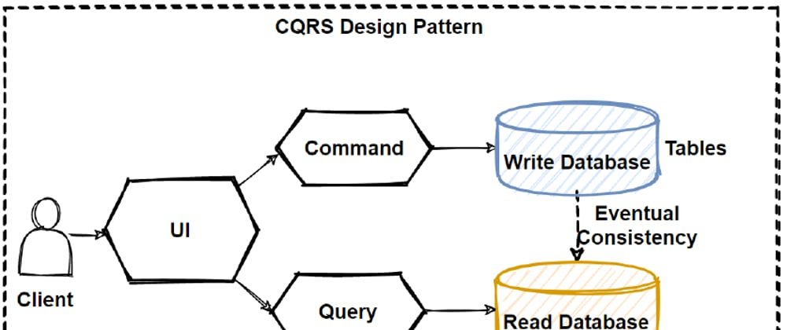
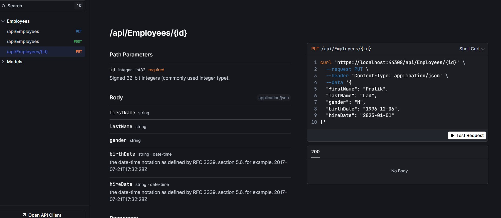
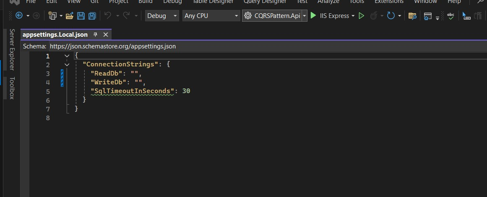
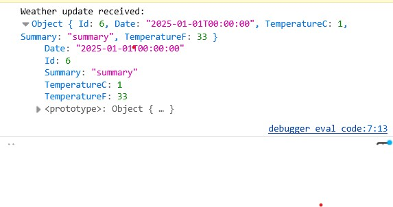

# CQRS Pattern Example in .NET 8
 

Command Query Responsibility Segregation (CQRS) is a software architectural pattern that separates the operations of reading data (queries) from modifying data (commands). This distinction allows for independent optimization of each operation, enhancing performance, scalability, and security in applications.

This repository demonstrates the **CQRS (Command Query Responsibility Segregation)** pattern using **.NET 8**. The project incorporates the **MediatR** library to enable flexible and standardized querying of data. It also features **OpenAPI documentation** for seamless exploration and understanding of the API. The application uses **Entity Framework** for data access, with two separate databases: one for write operations and another for read operations.
**HTTP/3/2/1** fallback code supports **Brotli** compression and falls back to **Gzip** for **response compression**.
**XUnit** Unit test for our projects.

# Project structure / technology
`Onion Layer principle` Dependencies can only be made 1 way. From outside to the inside.
To communicate from controller to our business logic layer (CQRSPattern.Application)
* .NET 8: Technology
* Entity Framework Core: ORM mapper of Microsoft
* MediatR: Framework written by J. Bogard to decouple code more easily

## Key Components

1. **CQRSPattern.Api**: Main API project with controllers and API endpoints
   - Contains employee and weather forecast controllers
   - Implements Server-Sent Events (SSE) for real-time updates

2. **CQRSPattern.Application**: Core application logic
   - Defines queries, commands, and models
   - Contains repository interfaces
   - Defines mediator interfaces for CQRS pattern

3. **CQRSPattern.Infrastructure.Mediator**: Implements the mediator pattern
   - Provides factory and scope for mediator operations

4. **CQRSPattern.Infrastructure.Persistence**: Data access layer
   - Separate DbContexts for read and write operations
   - Repository implementations for data access
   - Database migrations

5. **CQRSPattern.Migrator**: Database migration tool
   - Standalone executable for applying migrations

6. **Test Projects**: Various test projects for different layers
   - Application.Test
   - Infrastructure.Persistence.Test
   - Shared.Test (common test utilities)

7. **Directory.Packages.props**: Central package management file for consistent dependency versions across all projects

## Hosting projects: CQRSPattern.Api
The executing code runs from these projects.

## Example Included
# CQRS Pattern Solution

This CQRS solution demonstrates a modern approach to building scalable and maintainable .NET applications by separating read and write operations. The implementation follows these key architectural principles:

1. **Command-Query Separation**: Commands (write operations) are handled separately from queries (read operations), allowing each to be optimized independently.

2. **Domain-Driven Design**: The solution structure follows DDD principles with clear boundaries between different domains and concerns.

3. **Event-Driven Architecture**: Changes to data are communicated through events, enabling real-time updates using Server-Sent Events (SSE).

4. **Clean Architecture**: The codebase follows the onion architecture pattern with dependencies flowing from outside to inside layers.

This example includes:
- Employee management with CRUD operations
- Weather forecast service with real-time updates
- Server-Sent Events implementation for pushing updates to clients
- Separate read and write databases demonstrating true CQRS
- Comprehensive test projects for each layer of the application

The solution components work together to showcase how CQRS can be implemented in a real-world .NET application while maintaining clean code and separation of concerns.

## Central Package Management

This solution uses Central Package Management (CPM) to manage NuGet packages across all projects. This ensures consistent package versions throughout the solution and simplifies package updates.

### How It Works

- Package versions are defined in the `Directory.Packages.props` file at the solution root
- All projects automatically inherit these package versions
- No need to specify versions in individual project files

### Usage

#### Adding a package reference to a project

In your project file (.csproj):

Employee Endpoint

Multiple DB connections

SSE Console

## Libraries:
- **MediatR**: MediatR is a lightweight library designed for implementing the Mediator pattern in .NET applications.
- **OpenAPI Documentation**: Automatically generated API documentation using OpenAPI for better understanding and testing of the 
API.
- **Entity Framework**: Entity Framework (EF) is an open-source object-relational mapping (ORM) framework developed by Microsoft for .NET applications.
- **Scalar**: Replaces Swagger for calling and testing APIs.