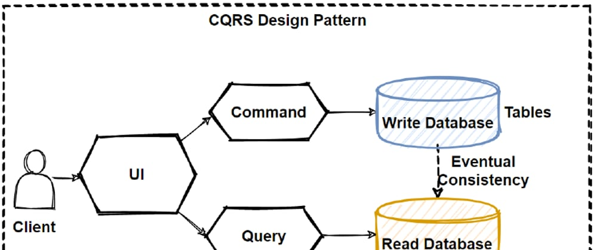
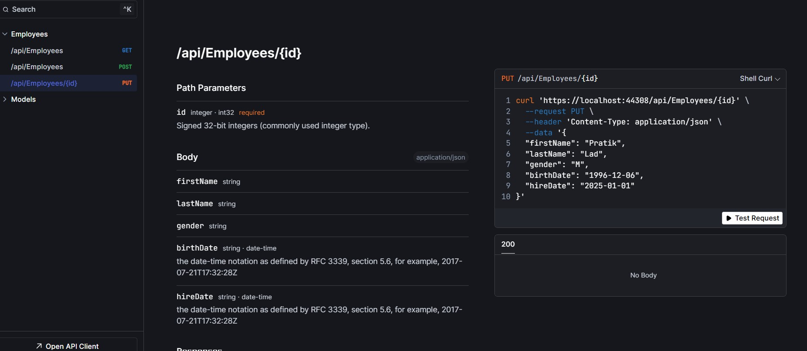
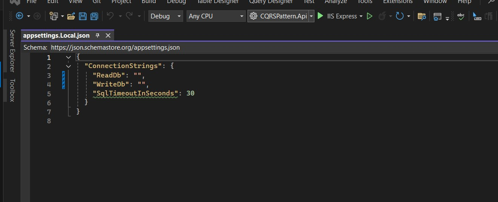
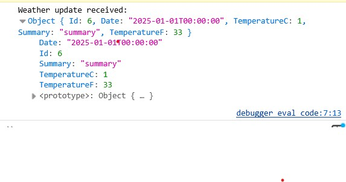

# CQRS Pattern with Unified MCP Server in .NET 9


This repository demonstrates the **CQRS (Command Query Responsibility Segregation)** pattern using **.NET 9**, featuring a **Unified API** that serves both **RESTful** endpoints and the **Model Context Protocol (MCP)** via a single application host.

## 🏗️ Unified Architecture

Unlike traditional implementations, this project merges REST and MCP into a single process. One command (`dotnet run`) launches:

- **REST API**: Standard HTTP controllers for web/mobile clients.
- **MCP HTTP Server**: Standardized protocol for AI integration (Postman, Claude, Gemini).
- **MCP Stdio Server**: Direct pipe for local IDE/LLM integration (Claude Desktop, etc.).

All protocols share the same **MediatR** core, ensuring **zero logic duplication** and consistent behavior across all access methods.



## 📋 Table of Contents

- [Getting Started](#-getting-started)
- [Project Structure](#-project-structure)
- [MCP Integration](#-mcp-integration)
- [Running Tests](#-running-tests)
- [Architecture Details](#-architecture-details)

## 🚀 Getting Started

### Prerequisites

- [.NET 9 SDK](https://dotnet.microsoft.com/download/dotnet/9.0)
- [MySQL Server](https://www.mysql.com/downloads/) (Connection string in `appsettings.json`)

### Quick Launch

```bash
# 1. Clone & Restore
git clone https://github.com/pratiksinghlad/CQRSPatternApi.git
cd CQRSPatternApi
dotnet restore

# 2. Run the Unified Server
dotnet run --project CQRSPattern.Api

# Server runs on: http://localhost:5001
# REST API: http://localhost:5001/api/employees
# MCP Endpoint: http://localhost:5001/mcp
# API Docs (Scalar): http://localhost:5001/scalar
```

## 🛠️ Project Structure

- **CQRSPattern.Api**: The unified host (REST + MCP HTTP/Stdio).
- **CQRSPattern.Application**: Core business logic, commands, queries, and MediatR handlers.
- **CQRSPattern.Infrastructure.Persistence**: Entity Framework Core with Dual-Database (Read/Write) support.
- **CQRSPattern.McpServer**: Standalone Stdio wrapper (for specific CLI use cases).

## 🌍 MCP Integration

This project is a first-class citizen of the **Model Context Protocol**. For detailed instructions on:

- Configuring MCP Clients (Postman, Claude, VS Code).
- Building your own .NET MCP Server.
- Using the C# MCP Client.

👉 **See the [MCP Documentation Guide (README_MCP.md)](README_MCP.md)**

## 🧪 Running Tests

We use **xUnit** and **NetArchTest** to ensure code quality and architectural integrity.

```bash
# Run all tests
dotnet test

# Run with coverage
dotnet test --collect:"XPlat Code Coverage"
```

## 📘 Architecture Details

The project follows **Clean Architecture** and **Onion Layer** principles. For deep dives into the design:

- **[ARCHITECTURE.md](ARCHITECTURE.md)**: Detailed diagrams and patterns.
- **[DDD_ANALYSIS.md](DDD_ANALYSIS.md)**: Domain-driven design breakdown.
- **[MCP_IMPLEMENTATION_SUMMARY.md](MCP_IMPLEMENTATION_SUMMARY.md)**: Technical details on the MCP bridge.

---

_Built with ❤️ using .NET 9 and modern CQRS principles._
| ------------------- | --------------- | -------------- | --------- | --------- |
| Port | 5000/5001 | 5002 | N/A | 5000/5001 |
| Extra Server Needed | No | Yes | Yes | No |
| IDE Integration | Via HTTP | Via HTTP | ✓ Native | No |
| Latency | Lowest | Low | N/A | Lowest |
| Logging/Monitoring | API only | API + Proxy | Separate | API only |
| Best For | Production | Development | AI Tools | Web Apps |

### Authentication

To use API key authentication (if configured):

**REST**:

```bash
curl -X GET http://localhost:5001/api/employees \
  -H "Authorization: Bearer YOUR_API_KEY"
```

**MCP HTTP**:

```bash
curl -X POST http://localhost:5001/mcp \
  -H "Authorization: Bearer YOUR_API_KEY" \
  -H "Content-Type: application/json" \
  -d '{"method": "employee.getAll"}'
```

**MCP stdio**: Configure `CQRS_API_KEY` in the environment variables section of `mcp.json`.

## Backward Compatibility

All existing REST endpoints remain fully functional:

- `GET /api/employees` - Get all employees
- `POST /api/employees` - Create employee
- `PUT /api/employees/{id}` - Update employee
- `PATCH /api/employees/{id}` - Partial update employee
- `PATCH /api/employees/{id}/jsonpatch` - JSON Patch operations

The MCP endpoint is an additional interface that coexists with REST endpoints.

## Example Included

# CQRS Pattern Solution

This CQRS solution demonstrates a modern approach to building scalable and maintainable .NET applications by separating read and write operations. The implementation follows these key architectural principles:

1. **Command-Query Separation**: Commands (write operations) are handled separately from queries (read operations), allowing each to be optimized independently.

2. **Domain-Driven Design**: The solution structure follows DDD principles with clear boundaries between different domains and concerns.

3. **Event-Driven Architecture**: Changes to data are communicated through events, enabling real-time updates using Server-Sent Events (SSE).

4. **Clean Architecture**: The codebase follows the onion architecture pattern with dependencies flowing from outside to inside layers.

This example includes:

- Employee management with CRUD operations
- Weather forecast service with real-time updates
- Server-Sent Events implementation for pushing updates to clients
- Separate read and write databases demonstrating true CQRS
- Comprehensive test projects for each layer of the application

The solution components work together to showcase how CQRS can be implemented in a real-world .NET application while maintaining clean code and separation of concerns.

## Central Package Management

This solution uses Central Package Management (CPM) to manage NuGet packages across all projects. This ensures consistent package versions throughout the solution and simplifies package updates.

### How It Works

- Package versions are defined in the `Directory.Packages.props` file at the solution root
- All projects automatically inherit these package versions
- No need to specify versions in individual project files

### Usage

#### Adding a package reference to a project

In your project file (.csproj):

Employee Endpoint


Multiple DB connections


SSE Console



## Libraries:

- **MediatR**: MediatR is a lightweight library designed for implementing the Mediator pattern in .NET applications.
- **OpenAPI Documentation**: Automatically generated API documentation using OpenAPI for better understanding and testing of the
  API.
- **Entity Framework**: Entity Framework (EF) is an open-source object-relational mapping (ORM) framework developed by Microsoft for .NET applications.
- **Scalar**: Replaces Swagger for calling and testing APIs.
